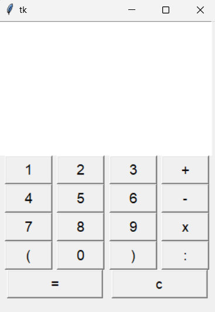

# Calculator
Hi, let me introduce myself, Ika Nurfitriani! This repository contains source code to create a simple calculator using Python. This application is useful for helping humans do calculations.

# Application Screenshots
The following is a screenshot of the Calculator:

## Author
[@Ika Nurfitriani](https://github.com/ikanurfitriani)